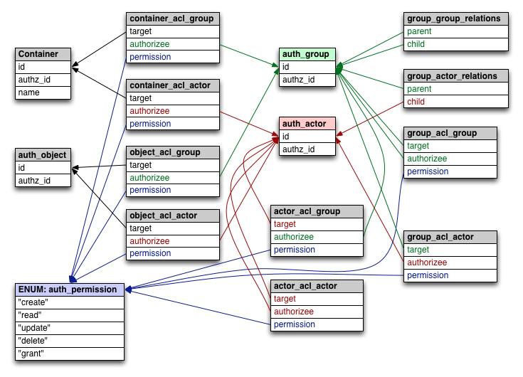

Authz PostgreSQL Schema
=======================



# Testing

We use [pgTAP][] to test both the schema and the stored procedures in
the database.

## Setup

For running on Mac OS X, [Postgres.app][] is hands-down the easiest.
Download and install!  Turn it on and you've got a database server!

You'll want to add the PostgreSQL binaries to your path before you do
anything else, though.

```
export PATH="/Applications/Postgres.app/Contents/MacOS/bin:$PATH"
```

Installing pgTAP into this server is straightforward as well.

```
git clone git://github.com/theory/pgtap.git
cd pgtap
make
make installcheck
make install
```

To run the pgTAP tests, you will need to install `pg_prove`:

```
sudo cpan TAP::Parser::SourceHandler::pgTAP
```

While `pg_prove` is not _strictly_ needed to run the tests, it creates
a much nicer experience.  It sets some formatting directives for you,
and also has the nice effect of making the return code reflect the
pass / fail state of the test suite.

## Running the Tests
Now create the database and install the schema:

```
psql -d postgres -c 'CREATE DATABASE authz;'
psql -d authz -c 'CREATE EXTENSION pgtap;'
psql -d authz -f sql/authz.sql
```

Now:

```
pg_prove --dbname authz --verbose test/*_test.sql
```

You should see something like this:

```
test/actor_is_authorized_on_object_test.sql ..
ok 1 - Function actor_has_permission_on_object(character, character, auth_permission) should be strict
ok 2 - Function actor_has_permission_on_object(character, character, auth_permission) should be STABLE
ok 3 - Function public.actor_has_permission_on_object(character, character, auth_permission) should return boolean
ok 4 - An actor directly granted permission XXX has the XXX permission
ok 5 - An actor both directly and indirectly granted permission XXX has the XXX permission
ok 6 - An actor indirectly granted permission XXX has the XXX permission
ok 7 - An actor indirectly granted permission XXX via nested groups has the XXX permission
ok 8 - An actor neither directly nor indirectly granted permission XXX does NOT have the XXX permission
ok 9 - actor_has_permission_on_object returns NULL if actor is NULL
ok 10 - actor_has_permission_on_object returns NULL if object is NULL
ok 11 - actor_has_permission_on_object returns NULL if permission is NULL
ok 12 - Checking of permission on non-existent object throws an exception
ok 13 - Checking of permission for non-existent actor throws an exception
ok 14 - Checking a non-existent permission throws an exception
1..14
ok
test/schema_test.sql .........................
ok 1 - Search path public should have the correct tables
ok 2 - Search path public should have the correct enums
ok 3 - Columns container(authz_id) should have a unique constraint
ok 4 - Columns auth_actor(authz_id) should have a unique constraint
ok 5 - Columns auth_group(authz_id) should have a unique constraint
ok 6 - Columns auth_object(authz_id) should have a unique constraint
ok 7 - Columns container(id) should be a primary key
ok 8 - Columns auth_actor(id) should be a primary key
ok 9 - Columns auth_group(id) should be a primary key
ok 10 - Columns auth_object(id) should be a primary key
ok 11 - Column container.id should be type bigint
ok 12 - Column auth_actor.id should be type bigint
ok 13 - Column auth_group.id should be type bigint
ok 14 - Column auth_object.id should be type bigint
ok 15 - Column container.name should be type text
ok 16 - Table object_acl_group should have the correct columns
ok 17 - Table object_acl_actor should have the correct columns
ok 18 - Table actor_acl_group should have the correct columns
ok 19 - Table actor_acl_actor should have the correct columns
ok 20 - Table group_acl_group should have the correct columns
ok 21 - Table group_acl_actor should have the correct columns
ok 22 - Table container_acl_group should have the correct columns
ok 23 - Table container_acl_actor should have the correct columns
ok 24 - Columns object_acl_group(target, authorizee, permission) should be a primary key
ok 25 - Columns object_acl_actor(target, authorizee, permission) should be a primary key
ok 26 - Columns actor_acl_group(target, authorizee, permission) should be a primary key
ok 27 - Columns actor_acl_actor(target, authorizee, permission) should be a primary key
ok 28 - Columns group_acl_group(target, authorizee, permission) should be a primary key
ok 29 - Columns group_acl_actor(target, authorizee, permission) should be a primary key
ok 30 - Columns container_acl_group(target, authorizee, permission) should be a primary key
ok 31 - Columns container_acl_actor(target, authorizee, permission) should be a primary key
ok 32 - Table group_group_relations should have the correct columns
ok 33 - Table group_actor_relations should have the correct columns
ok 34 - Columns group_group_relations(parent, child) should be a primary key
ok 35 - Columns group_actor_relations(parent, child) should be a primary key
ok 36 - group_acl_actor(target) should reference auth_group(id)
ok 37 - group_acl_actor(authorizee) should reference auth_actor(id)
ok 38 - group_acl_group(target) should reference auth_group(id)
ok 39 - group_acl_group(authorizee) should reference auth_group(id)
ok 40 - object_acl_actor(target) should reference auth_object(id)
ok 41 - object_acl_actor(authorizee) should reference auth_actor(id)
ok 42 - object_acl_group(target) should reference auth_object(id)
ok 43 - object_acl_group(authorizee) should reference auth_group(id)
ok 44 - actor_acl_actor(target) should reference auth_actor(id)
ok 45 - actor_acl_actor(authorizee) should reference auth_actor(id)
ok 46 - actor_acl_group(target) should reference auth_actor(id)
ok 47 - actor_acl_group(authorizee) should reference auth_group(id)
ok 48 - container_acl_actor(target) should reference container(id)
ok 49 - container_acl_actor(authorizee) should reference auth_actor(id)
ok 50 - container_acl_group(target) should reference container(id)
ok 51 - container_acl_group(authorizee) should reference auth_group(id)
1..51
ok
All tests successful.
Files=2, Tests=65,  0 wallclock secs ( 0.04 usr  0.00 sys +  0.01 cusr  0.01 csys =  0.06 CPU)
Result: PASS
```

[pgTAP]:http://pgtap.org
[Postgres.app]:http://postgresapp.com
